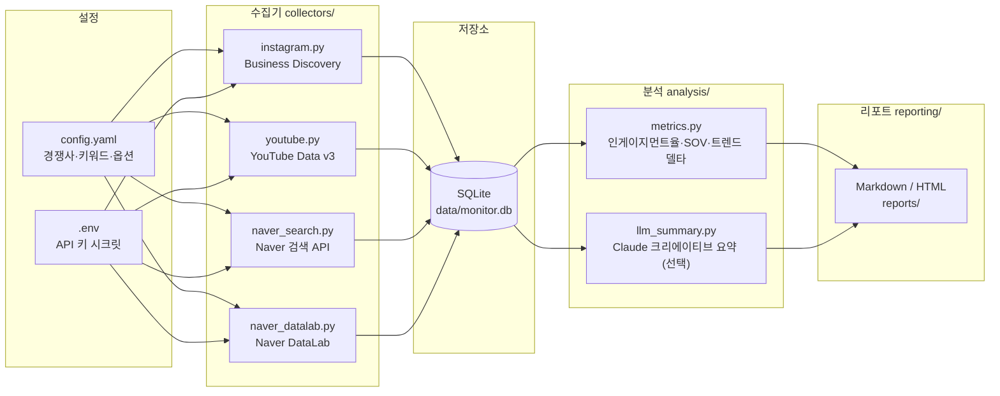

# 경쟁사 마케팅 모니터링 시스템

국내 아동 패션 브랜드를 위해 경쟁사(예: 뉴발란스 키즈)의 SNS·검색 데이터를 **무료 공식 API만** 사용해 자동 수집·분석하고, 주간 마케팅 리포트를 생성하는 config-driven 파이프라인입니다. 유료 소셜리스닝 도구와 스크래핑은 일절 사용하지 않으며, Instagram Business Discovery API, YouTube Data API v3, Naver 검색 API, Naver DataLab API를 통해 공개된 공식 데이터만 수집합니다. 수집한 데이터는 SQLite에 저장되고, 인게이지먼트율·Share of Voice·트렌드 델타 분석을 거쳐 Markdown/HTML 주간 리포트로 출력됩니다. Claude API(선택 옵션)로 크리에이티브 내용 요약을 보강할 수 있습니다.

---

## 아키텍처



---

## 디렉터리 구조

```
competitor_monitor/
├── __init__.py
├── cli.py                      # 진입점 — collect / report / run 서브커맨드
├── config.py                   # config.yaml + .env 로딩 (Settings / Secrets)
├── models.py                   # 레코드 dataclass — SQLite 테이블과 1:1 매핑
├── storage.py                  # SQLite upsert 레이어 (stdlib sqlite3, ORM 없음)
├── collectors/
│   ├── __init__.py
│   ├── base.py                 # Collector 추상 베이스 클래스
│   ├── instagram.py            # Instagram Business Discovery
│   ├── youtube.py              # YouTube Data API v3
│   ├── naver_search.py         # Naver 검색 API (buzz 건수)
│   └── naver_datalab.py        # Naver DataLab (상대 트렌드 지수 0-100)
├── analysis/
│   ├── metrics.py              # 인게이지먼트율, Share of Voice, 트렌드 델타
│   └── llm_summary.py          # Claude API 크리에이티브 요약 (선택)
└── reporting/
    └── report.py               # Markdown / HTML 주간 리포트 생성
```

설정 파일:

```
config.example.yaml   # config.yaml 템플릿 — 경쟁사·키워드·옵션 정의
.env.example          # .env 템플릿 — API 키 (절대 커밋 금지)
```

---

## 빠른 시작

### 1. 가상 환경 생성 및 의존성 설치

```bash
python -m venv .venv
source .venv/bin/activate        # Windows: .venv\Scripts\activate
pip install -r requirements.txt
```

### 2. 설정 파일 준비

```bash
cp config.example.yaml config.yaml
cp .env.example .env
```

`config.yaml`을 열어 다음 항목을 편집하세요.

- `instagram.ig_user_id` — 본인의 Instagram Business/Creator 계정 IG User ID
- `competitors` — 경쟁사 목록 (이름, `instagram_username`, `youtube_channel_id`, `keywords`)
- `naver.datalab_keyword_groups` — DataLab에서 추적할 키워드 그룹
- `analysis.llm.enabled` — Claude 요약 활성화 여부 (기본값: `false`)

`.env`를 열어 각 API 키를 채워 넣으세요.  
발급 방법은 **[docs/API_KEYS.md](docs/API_KEYS.md)** 를 참고하세요.

### 3. 실행

```bash
# 수집 + 리포트 + 대시보드 한 번에 (권장)
python -m competitor_monitor.cli run

# 수집만
python -m competitor_monitor.cli collect

# 리포트만 (이미 수집된 데이터 기반)
python -m competitor_monitor.cli report

# 정적 HTML 대시보드만 (이미 수집된 데이터 기반)
python -m competitor_monitor.cli dashboard
```

### API 키 없이 체험하기 (`--demo`)

```bash
python -m competitor_monitor.cli run --demo
```

`--demo` 플래그를 사용하면 번들된 샘플 데이터(경쟁사 5종 · 8주 시계열)를 로드하므로 API 키 없이도 리포트·대시보드 출력을 확인할 수 있습니다. 시스템 도입 전 UI·구조를 검토할 때 유용합니다.

---

## 대시보드

두 가지 형태의 대시보드를 제공합니다.

### 1) 정적 HTML 대시보드 (서버 불필요)

```bash
python -m competitor_monitor.cli dashboard          # 수집된 데이터 기반
python -m competitor_monitor.cli dashboard --demo   # 샘플 데이터로 미리보기
```

`reports/dashboard.html`(인터랙티브)과 `reports/dashboard.png`(이미지) 두 파일이
생성됩니다. HTML은 Chart.js(CDN)로 팔로워·구독자 추이, 검색 점유율(SoV), DataLab
트렌드, 인게이지먼트율 차트와 주목 콘텐츠 표를 렌더링하고, PNG는 matplotlib으로
동일 지표를 6분할 이미지로 그려 브라우저 없이도(메신저·문서 등) 바로 볼 수 있습니다.
경쟁사별 색상은 `competitor_monitor/branding.py`의 브랜드 컬러로 모든 대시보드에서
일관되게 적용됩니다.

### 2) Streamlit 인터랙티브 대시보드

```bash
streamlit run dashboard.py
```

경쟁사 필터, KPI 타일, 시계열 라인 차트 등을 인터랙티브하게 탐색할 수 있습니다.
사이드바에서 **"데모 데이터 사용"** 을 켜면 API 키 없이도 즉시 확인할 수 있습니다.
(`pip install -r requirements.txt` 시 `streamlit`·`pandas`가 함께 설치됩니다.)

---

## YouTube 채널 ID 찾기

`config.yaml`의 `youtube_channel_id`는 정확한 `UC…` 값이어야 합니다. 브랜드명으로
실제 채널 ID 후보를 조회해 주는 유틸리티를 제공합니다 (YouTube API 키 필요).

```bash
python -m competitor_monitor.tools.resolve_channels --config config.yaml --env .env
```

각 경쟁사별로 검색 결과 후보(제목 + `UC…` ID + 설명)를 출력합니다. 알맞은 ID를
골라 `config.yaml`에 붙여넣은 뒤 파이프라인을 실행하세요. (키가 없으면 발급 안내와
함께 종료됩니다 → `docs/API_KEYS.md`)

---

## 데이터 소스별 설명 및 주의 사항

### Instagram Business Discovery API

**수집 내용:** 경쟁사 프로필 스냅샷(팔로워 수·게시물 수), 최근 미디어(좋아요·댓글 수, 캡션, permalink).

**알려진 제한 사항:**

- **대상 계정이 반드시 Instagram 비즈니스 또는 크리에이터 계정이어야 합니다.** 개인 계정은 조회 불가합니다.
- 호출자(본인)도 Facebook 앱에 연결된 Instagram Business/Creator 계정(`instagram.ig_user_id`)이 있어야 합니다.
- Long-lived 액세스 토큰도 약 **60일마다 갱신**이 필요합니다. 갱신을 자동화하려면 시스템 사용자(System User) 토큰 발급을 고려하세요.
- `config.yaml`의 `instagram.ig_user_id`는 Graph API Explorer에서 `me/accounts` → `instagram_business_account` 필드로 확인합니다(자세한 방법은 docs/API_KEYS.md 참고).

### YouTube Data API v3

**수집 내용:** 채널 스냅샷(구독자 수·전체 조회수·영상 수), 최신 영상 목록(제목·조회수·좋아요·댓글 수).

**알려진 제한 사항:**

- 기본 할당량 **10,000 유닛/일**. 채널 조회 1회 ≈ 수 유닛이므로 경쟁사 수가 매우 많지 않으면 충분합니다.
- `youtube_channel_id`는 `UC`로 시작하는 채널 고유 ID입니다. 채널 URL의 `/channel/` 뒤 값 또는 채널 About 페이지 > 공유 링크에서 확인합니다.

### Naver 검색 API

**수집 내용:** 키워드별 블로그·카페·뉴스 게시물 건수(buzz 볼륨 프록시). `naver.search_sources`로 수집 소스를 선택합니다.

**알려진 제한 사항:**

- 일 할당량 약 **25,000건**. 경쟁사·소스 종류가 많으면 소진될 수 있으므로 `naver.search_sources`를 줄여 조절하세요.
- 반환 `total`은 Naver 색인 건수이며 절대적 언급량의 프록시로 활용합니다.

### Naver DataLab (검색어 트렌드)

**수집 내용:** `naver.datalab_keyword_groups`에 정의된 키워드 그룹의 상대적 검색량 추이.

**알려진 제한 사항:**

- 반환값은 **절대 검색량이 아닌 상대 지수(0–100)**입니다. 기간 내 최대값이 100으로 정규화되며 "월 N회 검색"과 같은 절대값은 알 수 없습니다. 그룹 간 비교 트렌드 파악에 활용하세요.
- `naver.datalab_keyword_groups`의 `groupName`이 SQLite `naver_datalab.keyword_group` 컬럼의 식별자가 됩니다.

### TikTok

**자동 수집 불가.** TikTok Creative Center에는 공식 퍼블릭 API가 없어 자동 수집을 지원하지 않습니다. 주 1회 [Creative Center](https://ads.tiktok.com/business/creativecenter) 를 수동으로 방문하여 트렌드를 확인하고 리포트에 수동으로 기록하세요.

---

## 스케줄링 (GitHub Actions)

`.github/workflows/monitor.yml`에 매주 월요일 00:00 UTC 자동 실행 워크플로우가 정의되어 있습니다.  
저장소 **Settings → Secrets and variables → Actions**에서 아래 시크릿을 등록하면 CI가 즉시 작동합니다.

| 시크릿 이름 | 필수 여부 | 설명 |
|---|---|---|
| `META_ACCESS_TOKEN` | 필수 | Instagram Business Discovery 액세스 토큰 |
| `YOUTUBE_API_KEY` | 필수 | YouTube Data API v3 키 |
| `NAVER_CLIENT_ID` | 필수 | Naver Open API 클라이언트 ID |
| `NAVER_CLIENT_SECRET` | 필수 | Naver Open API 클라이언트 시크릿 |
| `ANTHROPIC_API_KEY` | 선택 | Claude API 키 (`analysis.llm.enabled: true`일 때만 필요) |

수동 실행은 GitHub 저장소 → **Actions** 탭 → **Monitor Competitors** → "Run workflow" 버튼을 사용하세요.

수집된 리포트(`reports/`)와 DB(`data/`)는 워크플로우 실행 후 **Actions 아티팩트**로 다운로드할 수 있습니다.

---

## 법적·이용약관 고지

- 본 시스템은 **각 플랫폼의 공식 API를 통해 공개적으로 접근 가능한 데이터만** 수집합니다. 스크래핑이나 비공개 엔드포인트 접근은 수행하지 않습니다.
- 각 API의 이용약관(Meta Platform Policy, Google APIs Terms of Service, YouTube Terms of Service, Naver Open API 이용약관)을 반드시 준수하고, 요청 한도(rate limit)를 존중하세요.
- 수집한 원시 데이터는 내부 분석용 SQLite DB에만 저장하며, 외부에 재배포하지 않습니다.
- 집계 지표(인게이지먼트율, Share of Voice 등) 기반의 리포트를 내부 의사결정 목적으로만 활용하는 것을 권장합니다.
